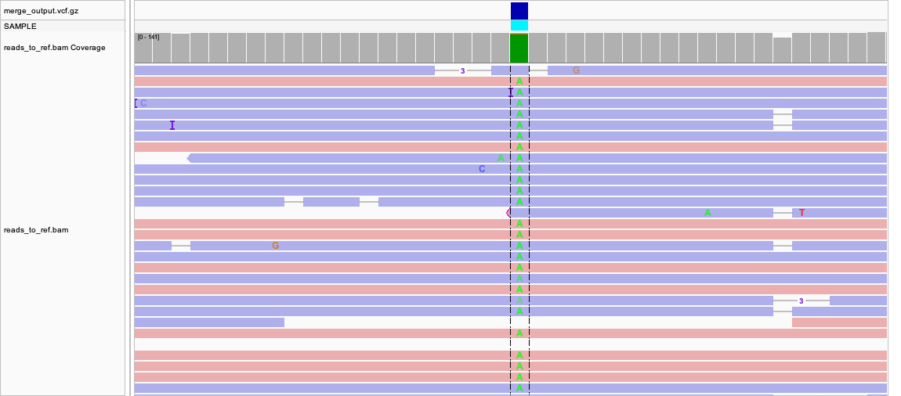
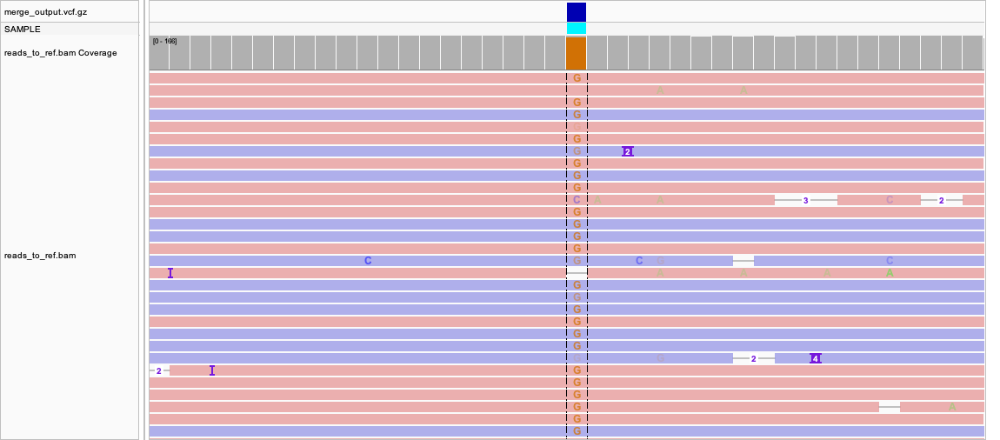

# 1. Introduction
Genomic sequencing has become a fundamental tool in microbial genomics, enabling comprehensive characterization of bacterial genomes and the genetic variation they contain. Advances in sequencing technologies have improved the cost, speed, and accessibility of genome-scale analyses, facilitating the use of both short-read and long-read sequencing platforms1,2. These platforms generate either short DNA reads, such as those produced by Illumina sequencing, or long DNA reads generated by Oxford Nanopore Technologies (ONT), each with distinct trade-offs in read length, accuracy, and analytical applications. Short-read sequencing produces highly accurate reads typically ranging from tens to hundreds of base pairs, whereas long-read sequencing generates reads spanning several to tens of kilobases1. When research objectives prioritize genome assembly and structural resolution, long-read sequencing offers clear advantages3. In this study, genome-scale sequencing data were used to reconstruct and analyze the bacterial pathogen Salmonella enterica.

Long-read sequencing has improved genome assembly by enabling more accurate reconstruction of complex genomes4. During genome assembly, overlapping reads are computationally joined to form contiguous sequences, or contigs, that represent continuous regions of the genome. In bacterial genomes such as Salmonella enterica, repetitive elements and plasmids complicate accurate genome reconstruction from short sequencing reads, whereas long-read sequencing can capture these features within single reads3,5. For long-read genome assembly, the Flye assembler was selected due to its design for error-prone long-read data and its demonstrated performance on bacterial genomes. Alternative long-read assemblers such as Canu were considered; however, Flye effectively assembles repetitive regions with lower computational requirements, making it well suited for ONT reads6. Given the repetitive elements and plasmids in Salmonella enterica, Flye balances assembly contiguity with tolerance to ONT sequencing errors7.

Following genome assembly, contigs are aligned to reference genomes to assess assembly accuracy and identify large-scale structural variation. Although long reads span repetitive and structurally complex regions, their error rates, particularly for insertions and deletions, limit reliable base-level interpretation. For this reason, genome assemblies are primarily used to evaluate overall genome structure, while accurate identification of small variants requires read-level alignment and variant calling approaches optimized for ONT data1,8.

To address challenges associated with base-level variant detection in ONT data, variants were called using Clair3, a deep learning-based variant caller optimized for long-read sequencing technologies. Alternative variant calling approaches, such as short-read–oriented callers, were considered; however, these methods are less effective at modeling systematic error patterns characteristic of nanopore sequencing. Clair3 integrates read alignment and machine learning approaches to improve discrimination between true variants and sequencing artefacts, particularly for insertions and deletions, making it well suited for variant detection in bacterial genomes sequenced using ONT9.

# 2. Methods
Oxford Nanopore Technologies (ONT) long-read sequencing data for Salmonella enterica were obtained from the NCBI Sequence Read Archive (SRA; accession SRR32410565)10. Raw sequencing reads were provided in FASTQ format and used directly for downstream quality control, genome assembly, and variant calling analyses. Read quality and length distributions were assessed prior to assembly to confirm suitability for long-read de novo genome reconstruction. As the dataset consisted of bacterial whole-genome sequencing data, additional host contamination filtering and heterozygosity estimation were not required.

## 2.2 Oxford Nanopore read quality control

Quality control (QC) of ONT long-read sequencing data was performed using NanoPlot v1.46.2 to evaluate overall sequencing quality and suitability for downstream genome assembly2. Summary metrics assessed included read length distribution, read length N50, total read count, and mean read quality score (Q score). NanoPlot was selected because it provides visualization tools specifically designed for ONT data and enables rapid assessment of long-read datasets without extensive preprocessing.

Read length histograms were examined to confirm the presence of long reads appropriate for de novo genome assembly, while bivariate plots of read length versus mean read quality were inspected to identify potential clusters of low-quality reads. QC results were used to determine whether additional filtering or trimming would be required prior to assembly.

## 2.3 Read filtering and preprocessing

Read filtering and trimming were evaluated based on NanoPlot QC results. Filtering would be applied if mean read quality fell below expected thresholds for ONT sequencing, if read length N50 was insufficient for effective long-read assembly, or if large clusters of low-quality reads were observed3. In such cases, Filtlong would be used to remove low-quality reads and enforce minimum read length thresholds suitable for long-read assembly3.

Aggressive trimming was avoided to prevent unnecessary loss of sequencing depth, as sufficient coverage is critical for robust de novo genome assembly. Based on QC results for this dataset, reads were deemed suitable for assembly with minimal preprocessing and were carried forward without extensive filtering.

## 2.4 De novo genome assembly

De novo genome assembly was performed using Flye v2.9.6, a long-read assembler optimized for error-prone sequencing technologies such as Oxford Nanopore. Flye constructs assemblies using repeat graphs, allowing effective resolution of repetitive genomic regions and plasmids commonly present in bacterial genomes.

Assembly was conducted using parameters appropriate for high-quality ONT data, including the `--nano-hq` option, which assumes an error rate consistent with modern ONT basecalling2. Default Flye parameters were otherwise used, with multithreading enabled to optimize computational performance. The resulting draft assembly consisted of contiguous sequences representing chromosomal and plasmid components of the Salmonella enterica genome.

## 2.5 Reference-based alignment of long reads

To support downstream variant analysis, raw ONT reads were aligned directly to a reference genome rather than relying solely on assembled contigs. A reference genome for Salmonella enterica was obtained from the NCBI RefSeq database (accession GCF_000006945.2)11. Read-level alignment was performed using Minimap2 v2.30, an aligner designed for long-read sequencing data that balances speed and alignment accuracy.

Alignments were generated using the map-ont preset, which is optimized for the error profile of ONT reads and accounts for long insertions, deletions, and split alignments. Alignment files were sorted and indexed to produce BAM files suitable for downstream variant calling.

## 2.6 Variant calling

Single-nucleotide variants (SNVs) and small insertions and deletions (indels) were identified using Clair3, a deep learning-based variant caller optimized for Oxford Nanopore sequencing data9. Variant calling was performed using the `--platform` ont parameter to ensure appropriate modeling of ONT-specific error profiles. Variant detection was enabled across all contigs using the `--include_all_ctgs` option to ensure inclusion of plasmid and smaller contigs. Multithreading was used to improve computational efficiency. Output variant call format (VCF) files were compressed, sorted, and indexed for downstream visualization and inspection.

## 2.7 Variant visualization and manual inspection

Variant calls and read alignments were visualized using the Integrative Genomics Viewer (IGV; desktop application)3. BAM and VCF files were loaded alongside the reference genome to facilitate manual inspection of representative variants. Alignments were colored by base, and coverage tracks were adjusted to enable clear visualization of variant support.

Manual inspection focused on evaluating read-level evidence for selected variants, including consistency across multiple reads, strand support, and positional stability within alignments. Particular attention was paid to regions prone to ONT sequencing artefacts, such as homopolymer tracts and low-complexity regions.

# 3. Results

**Table 1.** Summary of Variant Counts
| Variant Category  | Count  |
| ------------- | ------------- |
| Total SNVs  | 9,738  |
| Total Indels  | 530  |
| Missense | 3,149 |
| Synonymous  | 4,920  |
| Intergenic  | 1,636  | 

**Table 2.**  Gene Location and Function
| Gene  | Location  | Function  |
| ------------- | ------------- | ------------- |
| PSLT068  | pSLT virulence plasmid  | Outer membrane lipoprotein involved in surface exclusion  |
| STM1022  | Chromosome  | Chaperone-associated protein involved in stress response  |

# 4. Discussion

Oxford Nanopore long-read sequencing was used to assemble and analyze the Salmonella enterica genome using a combination of genome assembly and read-level variant calling. Salmonella enterica possesses a single circular bacterial chromosome and may carry plasmids, and its genome contains repetitive elements that can complicate reconstruction12. The Flye assembly produced a contiguous genome consistent with this expected organization. Long reads were able to span repetitive regions and plasmid sequences, which often cause fragmentation in short-read assemblies3. As a result, this approach was well suited for examining overall genome structure. However, because long-read sequencing is less accurate at the base level, the assembly was more informative for structural analysis than for identifying precise genetic variants.

## 4.2 IGV-based variant interpretation

Two single-nucleotide variants and one small insertion/deletion were examined through manual inspection in IGV. Figures 1 and 2 show two single-nucleotide variants: a G to A substitution at NC_003197.2:1,224,522–1,224,561 and an A to G substitution at NC_003197.2:2,762,698–2,762,737. Both variants were supported by multiple aligned reads and were consistently identified by Clair3, indicating high-confidence variant calls. Figure 3 shows a small insertion/deletion at NC_003197.2:2,772,520–2,772,559, which exhibited read-level support and was also detected by Clair3 but was interpreted more cautiously due to the higher indel error rate associated with ONT sequencing. These examples demonstrate that SNVs can be identified with higher confidence than indels in long-read sequencing data, underscoring the importance of manual variant interpretation13.

**Figure 1.** Single-nucleotide variant (G→A) identified in Salmonella enterica.  

**Figure 2.** Single-nucleotide variant (A→G) identified in Salmonella enterica.  

**Figure 3.** Small insertion/deletion detected in Salmonella enterica.

Variant interpretation was limited by base-level errors common in Oxford Nanopore sequencing, particularly for insertions and deletions. Reads were not stringently filtered prior to variant calling, which likely allowed lower-quality reads to contribute noise in indel-prone regions. Additional read filtering using tools such as NanoFilt could reduce this noise and improve indel interpretation13. Variant calling was also based solely on long-read data, without short-read polishing or independent validation, which reduced confidence in base-level accuracy. Combining read filtering with hybrid sequencing or short-read polishing would improve confidence in small-variant detection, particularly for indels.

# Reference List
1.	Brlek P, Bulić L, Bračić M, Projić P, Škaro V, Shah N, et al. Implementing Whole Genome Sequencing (WGS) in Clinical Practice: Advantages, Challenges, and Future Perspectives. Cells. 2024 Jan;13(6):504. 
2.  Guiglielmoni N. De novo Genome Assembly Using Long Reads and Chromosome Conformation Capture. In: Bonizzoni M, Ometto L, editors. Insect Genomics: Methods and Protocols [Internet]. New York, NY: Springer US; 2025 [cited 2026 Jan 15]. p. 1–27. Available from: https://doi.org/10.1007/978-1-0716-4583-3_1 
3.  Wick RR, Judd LM, Holt KE. Assembling the perfect bacterial genome using Oxford Nanopore and Illumina sequencing. PLOS Computational Biology. 2023 Mar 2;19(3):e1010905. 
4.  Szakállas N, Barták BK, Valcz G, Nagy ZB, Takács I, Molnár B. Can long-read sequencing tackle the barriers, which the next-generation could not? A review. Pathol Oncol Res. 2024 May 16;30:1611676. 
5.  Kitchens SR, Wang C, Price SB. Bridging Classical Methodologies in Salmonella Investigation with Modern Technologies: A Comprehensive Review. Microorganisms. 2024 Nov;12(11):2249. 
6.  Sun J, Li R, Chen C, Sigwart JD, Kocot KM. Benchmarking Oxford Nanopore read assemblers for high-quality molluscan genomes. Philos Trans R Soc Lond B Biol Sci. 376(1825):20200160. 
7.  Schiffer AM, Rahman A, Sutton W, Putnam ML, Weisberg AJ. A comparison of short- and long-read whole-genome sequencing for microbial pathogen epidemiology. mSystems. 10(12):e01426-25. 
8.  Chen Y, Nie F, Xie SQ, Zheng YF, Dai Q, Bray T, et al. Efficient assembly of nanopore reads via highly accurate and intact error correction. Nat Commun. 2021 Jan 4;12(1):60. 
9.  Zheng Z, Yu X, Chen L, Lee YL, Xin C, Wong AOK, et al. Clair3-RNA: a deep learning-based small variant caller for long-read RNA sequencing data. Nat Commun. 2025 Dec 22;16(1):11553. 
10. Sequence Read Archive :: NCBI [Internet]. [cited 2026 Feb 8]. Available from: https://trace.ncbi.nlm.nih.gov/Traces/?run=SRR32410565 
11. Salmonella enterica subsp. enterica serovar Typhimurium str. LT2 genome assembly ASM694v2 [Internet]. NCBI. [cited 2026 Feb 8]. Available from: https://www.ncbi.nlm.nih.gov/datasets/genome/GCF_000006945.2/ 
12. Dziegiel AH, Duong VT, Bloomfield SJ, Thomson NR, Maskell DJ, Wain J, et al. Metagenomic identification of disease-causing Salmonella enterica serovars and antimicrobial resistance genes from paediatric faecal samples. Microbial Genomics. 2025;11(10):001547. 
13. Chen S, Nie F, Wang J. NanoFilter: enhancing phasing performance by utilizing highly consistent INDELs and SNVs in nanopore sequencing. Bioinformatics. 2025 Sep 1;41(9):btaf453. 

